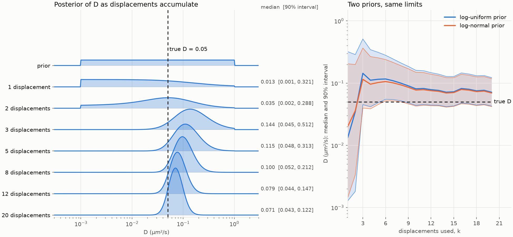
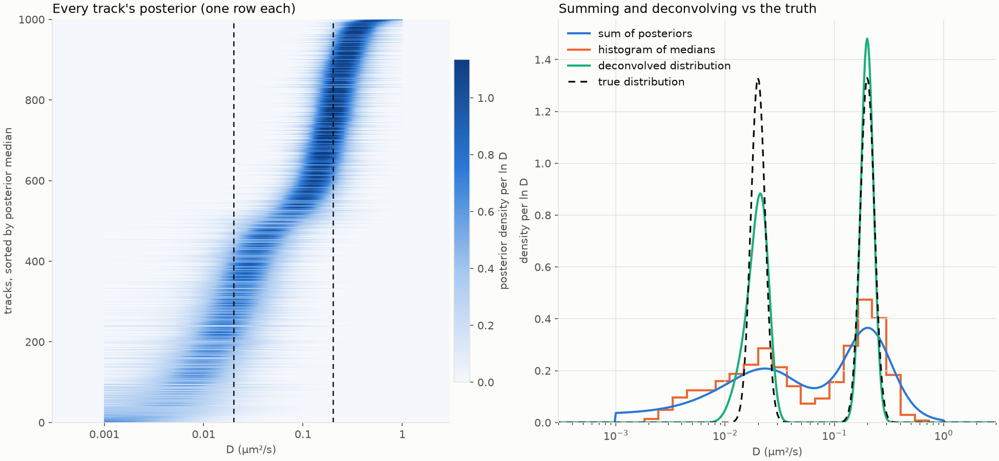
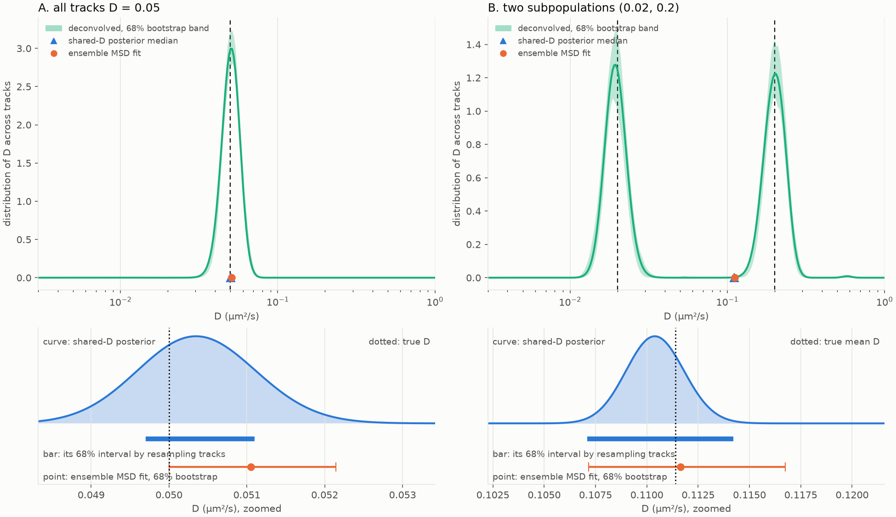
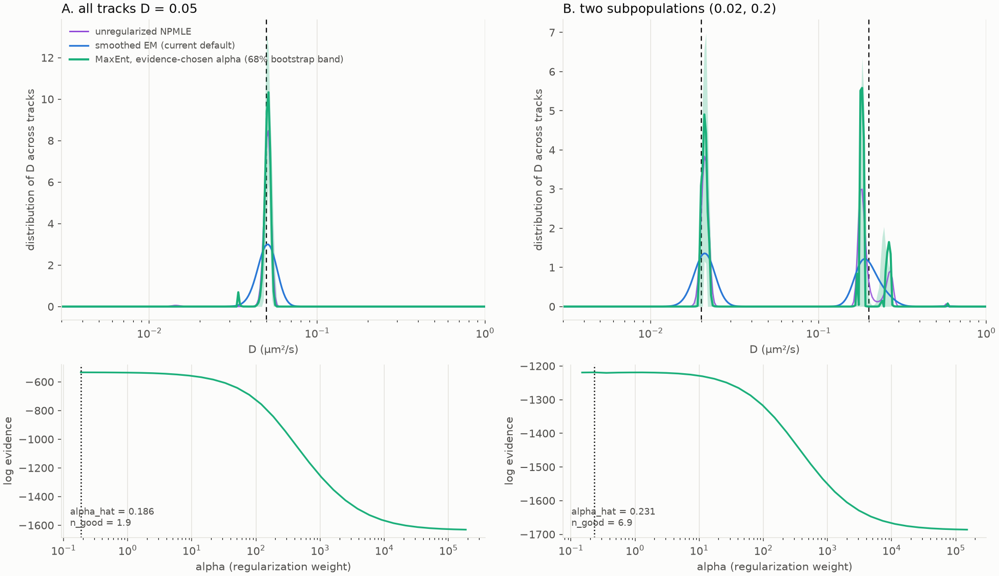
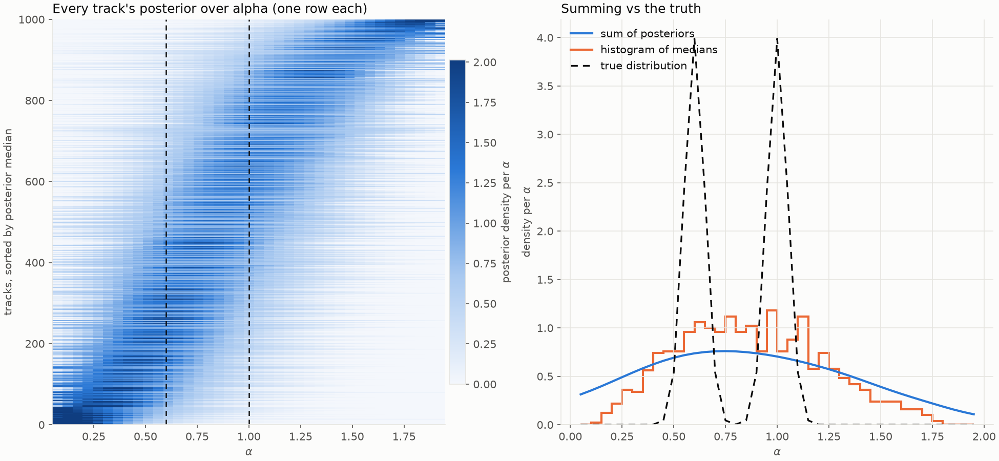

# Short-track posterior prototype

Standalone prototype (numpy, scipy; matplotlib for the demos; **nothing imported
from `diffusionkit`**) for the diffusion coefficient `D` of very short tracks
(5-20 frames) with known per-frame localization error. It is not wired into the
classical workflow, and the checks below are simulation checks under the model,
not a calibration claim on experimental tracks.

Three levels, each answering a different question:

| level | question | function |
|---|---|---|
| per track | what does this one track say about `D`, with bounds? | `track_loglik` + `posterior` + `summary` |
| shared `D` | what is the posterior of one `D` if all tracks share it? (analog of an ensemble MSD fit) | `pooled` |
| distribution | how is `D` distributed across tracks? | `deconvolve` |

Per-track posteriors are the primary output. The two population-level pieces are
comparators for an ensemble MSD fit and a check on heterogeneity.

```python
import numpy as np
import posterior_1d as P            # run from prototypes/, or put it on sys.path

prior = P.log_uniform(1e-3, 1.)     # D limits in um^2/s
ll = P.track_loglik(x_um, sd_um, dt_s, on_time_s)   # x (n, 2); sd (n,) or (n, 2)
p = P.posterior(ll, prior)          # weights on the ln D grid P.U
P.summary(p, level=.6827)           # {'median', 'lo', 'hi'} = q50, q16, q84 of D

lls = np.array([...])               # one track_loglik row per track
P.pooled(lls, prior)                # posterior of one shared D
P.deconvolve(lls, prior)            # distribution of D across tracks (weights on P.U)
```

## Model

Per axis a track of `n` frames gives `m = n - 1` displacements `d`, and

    d ~ N(0, D A + B)

- `A` (per unit `D`) is Brownian motion averaged over the on-time `tau`, a box
  shutter ([Berglund 2010](https://doi.org/10.1103/PhysRevE.82.011917)).
  `on_time` is how long light is collected within a frame: the camera exposure
  for continuous illumination, the pulse width for a strobed laser. With
  `R = tau / (6 dt)` the diagonal is `2 dt (1 - 2R)` and the lag-1 term is
  `+2 dt R`; `on_time = 0` gives `2 dt I`. Requires `on_time <= dt`.
- `B` is the known localization noise: `B_ii = s_i^2 + s_(i+1)^2`,
  `B_(i,i+1) = -s_(i+1)^2`. `D` scales only `A`, so no prior on `D` is
  conjugate.
- The two axes are independent given `D`, so their log-likelihoods add.

One generalized eigendecomposition `A v = lam B v` whitens the displacements;
the log-likelihood on any `D` grid is then `-1/2 sum_k [ln(1 + D lam_k) +
y_k^2 / (1 + D lam_k)]` + const. The posterior lives on a fixed grid in
`u = ln D` (`P.U`, 1e-4 to 10 um^2/s), so a prior flat in `u` is log-uniform in
`D`.

**Sequential updating.** Localization noise correlates adjacent displacements,
so multiplying single-displacement likelihoods double-counts. The exact
posterior after `k` displacements is the posterior of the track truncated to
`k + 1` frames; `sequence` does exactly that.

## Demos

```bash
uv run python prototypes/demo_sharpening.py   # one track, posterior sharpening
uv run python prototypes/demo_ensemble.py     # 1000 tracks: views of many posteriors
uv run python prototypes/demo_population.py   # shared-D and distribution vs MSD
uv run python prototypes/demo_maxent.py       # deconvolve: NPMLE vs smoothed EM vs MaxEnt+evidence
uv run --with pytest pytest prototypes        # tests
```

### One track, adding displacements



A simulated track (`D = 0.05`, dt 35 ms, on-time 20 ms) from a prior set by the
instrument limits. The 90% interval is about two decades wide after 1-2
displacements and a factor of about 3 after 20. The right panel shows a
log-uniform and a log-normal prior with the same limits.

### Many tracks



Every track's posterior as one row of a heat map, sorted by median, is the
recommended view: a track's information is visible as how narrow and bright its
row is. **Summing the posteriors is not a population estimate.** Each posterior
includes the prior and each track's own uncertainty, so the sum is the true
distribution blurred by both. With two subpopulations 10x apart the summed
peaks are about 3.7x too wide (SD in ln `D` 0.55 vs 0.15), and the histogram of
per-track medians is nearly as bad (0.42). It does recover coarse mass: the
fraction above a threshold came out within 0.02 of the truth overall (0.03 for
the 5-7-frame tracks).

### Population level



1000 tracks, 5-20 frames, truth known. 68% intervals:

| | shared-`D` posterior | same, resampling tracks | ensemble MSD fit (bootstrap) |
|---|---|---|---|
| A. all `D` = 0.05 | [0.0496, 0.0511] | [0.0497, 0.0511] | [0.0500, 0.0521] |
| B. modes at 0.02 and 0.2 | [0.1090, 0.1118] | [0.1071, 0.1142] | [0.1072, 0.1168] |

- Homogeneous data: the posterior matches its own track-resampling interval and
  is about 1.5x tighter than the MSD fit.
- Heterogeneous data: the shared-`D` posterior estimates a mean-like `D`
  (0.110; true mean 0.111) that no track has, and its interval is 2.5x too
  narrow because it cannot see between-track spread. Pair it with a track
  bootstrap or with `deconvolve`.

`deconvolve` estimates the distribution `g(D)` of true `D` across tracks by
maximizing `sum_i log sum_D L_i(D) g(D)` over grid weights (nonparametric
maximum likelihood for a mixing distribution), using EM: each iteration
replaces `g` with the average of the tracks' posteriors under the current `g`
as prior. One iteration from the flat start, unsmoothed, is exactly the plain
sum of posteriors; further iterations remove its blur. It uses each track's
likelihood, not its posterior, so the prior is not counted once per track. It
recovers the two modes and their masses (0.499 / 0.501 vs 0.5 / 0.5). Peak
widths depend on the `smooth` regularizer (default 0.5 grid cells, chosen
against the truth here): read a deconvolved width as resolution-limited, not
measured. Bands come from resampling tracks and re-running it.

### MaxEnt deconvolution, alpha chosen by evidence



`deconvolve`'s objective, `sum_i log sum_D L_i(D) g(D)`, is only concave, not
strictly concave, so its unregularized optimum (`smooth=0`) can put mass on a
handful of grid cells -- `smooth` guards against this with a fixed Gaussian
blur per EM step, chosen by eye against a known truth, which is not available
on real data. `maxent_deconvolve.py` (companion module, same
numpy/scipy-only, no `diffusionkit` import) regularizes properly instead:
maximize `log L(w) + alpha * S(w)` over the grid simplex, where
`S(w) = -sum_k w_k log(w_k / m_k)` is the cross-entropy against a default
measure `m` (flat by default). For any `alpha > 0` this is *strictly*
concave (`S`'s Hessian is `-diag(1/w)`), so its maximizer is unique and
cannot be a spike, by construction rather than by tuning.

`alpha` is chosen the way Gull & Skilling (1989, "Developments in Maximum
Entropy Data Analysis") choose it for MaxEnt image reconstruction: maximize
the Laplace-approximated evidence
`P(data | alpha) ~= alpha*S(w_alpha) + log L(w_alpha) - 1/2 sum_k log(1 +
lambda_k/alpha)`, where `lambda_k` are the generalized eigenvalues of the
data's curvature against the entropy metric, restricted to the simplex's
tangent hyperplane -- one dense `~500x500` eigendecomposition per trial
`alpha`, since `w` here is a 1D `~500`-point grid, not a multi-megapixel
image, so the full Skilling-Bryan control-subspace search isn't needed. `w`
is parametrized as `softmax(theta)` to turn the constrained simplex problem
into an unconstrained one solved with L-BFGS-B; this is safe (doesn't distort
the eigenvalues the evidence formula depends on) because the softmax
Jacobian's correction to the Hessian vanishes exactly at the constrained
optimum. v1 picks `alpha` as the argmax of a `log`-spaced scan (`alpha_grid`
built from the data's own curvature scale), not a continuous refinement.

On the same 1000-track datasets used above: for the homogeneous dataset the
evidence prefers *less* regularization than `deconvolve`'s default `smooth`
(and, with this many highly informative tracks, sits at the edge of the
default `alpha_grid` -- widen it if that warning fires); for the two-mode
dataset both true modes are recovered with masses matching `deconvolve`'s,
without hand-tuning a width. `n_good = sum lambda_k/(alpha+lambda_k)` (Gull's
"number of good measurements") is a data-driven complexity readout: about 2
for the homogeneous dataset, about 7 for the two-mode one. See the module
docstring in `maxent_deconvolve.py` for the exact formulas and derivation.

Scope: `D` only for now. `posterior_alpha.py`'s per-track curve is already a
`K`-marginalized approximation, not a clean likelihood the way `track_loglik`
is for `D`; feeding it through the same evidence machinery would conflate two
different approximations, so it's left for a later extension.

## Design decisions and the evidence

Scripts in `studies/` reproduce these (simulated 2D tracks, dt 35 ms, on-time
20 ms, sigma 35 nm).

- **Known localization SDs, grid evaluation.** `studies/short_track_bias.py`
  compares MLE with sigma known, MLE with sigma fitted, the covariance-based
  estimator (CVE, [Vestergaard 2014](https://doi.org/10.1103/PhysRevE.89.022726))
  and the posterior median. The MLE with *fitted* sigma is biased low when motion
  dominates (mean `D`-hat/`D` 0.76, 0.85, 0.92, 0.96 at 5, 10, 20, 40 frames,
  `D` = 0.3); with sigma known the mean is within a few percent of 1 (except
  noise-dominated `D` = 0.01 at 5 frames, 1.22, from a heavy right tail). The CVE
  is unbiased in the mean but its RMSE is 1.3-2x the known-sigma MLE, and it
  returns `D`-hat <= 0 for 31% of tracks at 5 frames and 17.5% at 20 frames
  (`D` = 0.01). The posterior median is never <= 0 and matches the
  known-sigma MLE within 0.02 in relative RMSE, and is better for short
  noise-dominated tracks. The CVE's real advantage is that it does not use
  sigma. The "N < 25" statement sometimes attributed to that paper could not be
  verified from its abstract, which only says the CVE outperforms the MLE in experimentally relevant
  ranges.
- **Report quantiles, headline the median.** `summary(p, level=.6827)` gives
  q16/q50/q84, the analogue of +-1 SD, and is invariant under reparametrization
  of `D`. `studies/posterior_summaries.py` compares the median with the mean of
  `D` and of ln `D`: the mean of `D` is biased high (2.04 at 5 frames,
  `D` = 0.01) and, at short lengths (`D` = 0.3, 5 frames), 4x more sensitive to
  the prior's upper limit; no summary is
  robust to the lower limit when a short track is noise-dominated (the median
  moves by a factor of about 1.6 when `D_lo` moves 3x). The interval already
  says so: it is x38 wide there.
- **Prior limits are a choice.** Defaults are 1e-3 to 1 um^2/s (below: motion
  hides under localization noise; above: blur past tracking at ~100 Hz). Hard
  log-uniform edges (`log_uniform`) or soft ones (`log_normal`).
- **Numerics.** The log-determinant of `B` uses Cholesky, not `slogdet`, which
  raises floating-point warnings for 40 or more frames.

## Tests

`test_posterior_1d.py`: the whitened likelihood equals a direct multivariate
normal; the motion kernel matches an independent fine-step simulation;
`sequence` is causal; 90% intervals cover about 90% for truths drawn from the
prior (5 and 12 frames, both priors); one unsmoothed EM step equals the sum of
posteriors; EM never lowers the likelihood; the shared-`D` posterior is
calibrated when tracks share `D`; the mode masses are recovered.

The calibration checks are weak against a blur mis-specification, because the
prior spans three decades; the direct-Gaussian and kernel tests are what pin the
blur down.

## Assumptions and limits

- Contiguous frames (no gaps); box shutter with `on_time <= dt`.
- The localization SDs are correct. A wrong SD scale shifts inferences as much
  as physics does; the CVE, which never uses sigma, is the robust alternative.
  The natural next check is scaling the SDs by 0.8 and 1.2.
- Isotropic 2D, both axes sharing `D`.
- The shared-`D` posterior can be narrower than `P.U`'s 2.3% step for many
  tracks: recompute `lls` on a fine local grid (`demo_population.py` does).
- Whether tracks share one `D` (versus a distribution) is judged by eye from
  `deconvolve` and the bootstrap; there is no calibrated test yet.

## Companion: posterior over alpha

`posterior_alpha.py` generalizes the same idea to the fBm exponent `alpha`,
as an honest alternative to a single calibrated statistic testing "is this
Brownian?" (this project's retired non-Brownian z-score): it reports a full
posterior over `alpha` that stays wide when a short track genuinely can't
resolve it. `diffusionkit.gridpost.posterior_alpha` is the production version
of this module -- see [docs/classical.md](../docs/classical.md).

For a *fixed* `alpha`, the fGn displacement covariance is linear in the
generalized diffusion coefficient `K` exactly as the Brownian covariance is
linear in `D`, so the same whitening trick applies unchanged at every grid
point in `alpha`; the 2D `(alpha, ln K)` log-likelihood surface is then
collapsed to a 1D posterior over `alpha` by marginalizing `ln K` (a nuisance
parameter, `K`'s own hand-set prior) with `logsumexp`. No exposure-blur
model: the closed-form Berglund `R` average this module's `D`-posterior uses
is specific to alpha=1 (a linear-motion double integral); no comparably
simple closed form exists at a general `alpha`, so this assumes
`exposure_s=0`, matching `diffusionkit.bayes.model`'s existing
simplification.

```bash
uv run python prototypes/demo_alpha_ensemble.py   # 1000 tracks: same "sum vs truth" story, for alpha
uv run --with pytest pytest prototypes/test_posterior_alpha.py
```



Same story as the `D` ensemble view: summing per-track posteriors (or
histogramming their medians) badly overstates the width of each `alpha`
subpopulation, while each row's own brightness/width still shows that
track's real information. This file itself remains a standalone research
prototype (population-level views, no dependency on `diffusionkit`); the
per-track posterior it explores is production in
`diffusionkit.gridpost.posterior_alpha`.

## Related literature (via PubMed)

- Berglund 2010, Phys Rev E 82:011917. [10.1103/PhysRevE.82.011917](https://doi.org/10.1103/PhysRevE.82.011917) - MLE with localization noise and motion blur; the blur coefficient `R`.
- Michalet & Berglund 2012, Phys Rev E 85:061916. [10.1103/PhysRevE.85.061916](https://doi.org/10.1103/PhysRevE.85.061916)
- Vestergaard, Blainey & Flyvbjerg 2014, Phys Rev E 89:022726. [10.1103/PhysRevE.89.022726](https://doi.org/10.1103/PhysRevE.89.022726) - the CVE.
- Relich et al. 2016, Phys Rev E 93:042401. [10.1103/PhysRevE.93.042401](https://doi.org/10.1103/PhysRevE.93.042401) - blur, gaps and per-frame localization uncertainty in one likelihood.
- Bullerjahn & Hummer 2021, J Chem Phys 154:234105. [10.1063/5.0038174](https://doi.org/10.1063/5.0038174) - maximum likelihood with subpopulation mixtures by EM.

No per-track posterior with a physical-limit prior turned up in these
searches (PubMed misses physics venues), so treat that as unconfirmed novelty.
